# ECOMMERCE

## Task 1: Project & Workflow Setup:
Create Repo: Name it ecommerce-platform, with two directories: api (backend) and webapp (frontend).


## Task 2:  Initialize GitHub Actions:

Add .github/workflows/ folder.
Create initial workflows for CI—one for backend, one for frontend. where we the code snipet where use to automate integration on both end

# for backend:

                        name: Backend CI

                        on:
                        push:
                            paths:
                            - 'backend/**'
                        pull_request:
                            paths:
                            - 'backend/**'

                        jobs:
                        backend-build:
                            runs-on: ubuntu-latest

                            defaults:
                            run:
                                working-directory: backend

                            steps:
                            - name: Checkout code
                                uses: actions/checkout@v3

                            - name: Set up Node.js
                                uses: actions/setup-node@v4
                                with:
                                node-version: '18'

                            - name: Install dependencies
                                run: npm install

                            - name: Run tests
                                run: npm test

# for frontend:

                            name: Frontend CI

                            on:
                            push:
                                paths:
                                - 'frontend/**'
                            pull_request:
                                paths:
                                - 'frontend/**'

                            jobs:
                            frontend-build:
                                runs-on: ubuntu-latest

                                defaults:
                                run:
                                    working-directory: frontend

                                steps:
                                - name: Checkout code
                                    uses: actions/checkout@v3

                                - name: Set up Node.js
                                    uses: actions/setup-node@v4
                                    with:
                                    node-version: '18'

                                - name: Install dependencies
                                    run: npm install

                                - name: Build project
                                    run: npm run build

                                # Optional: Run tests
                                - name: Run tests
                                    run: npm test


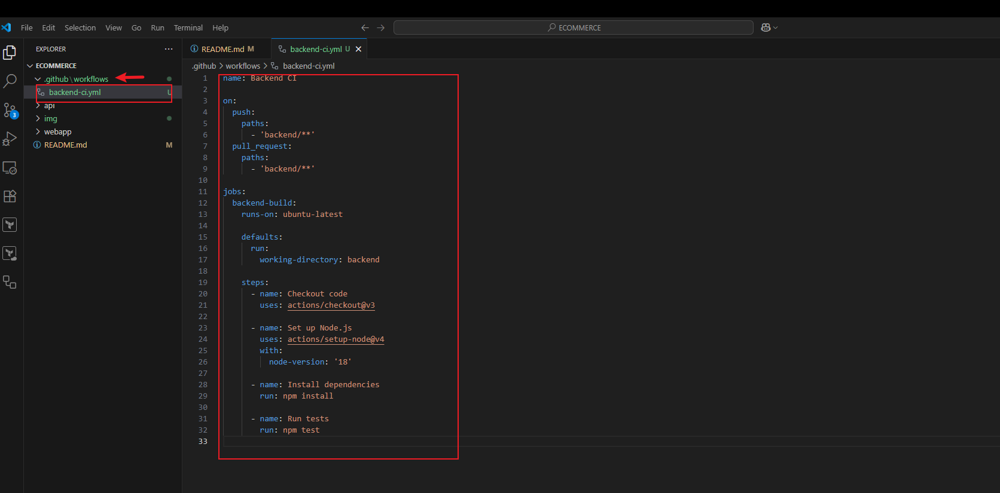
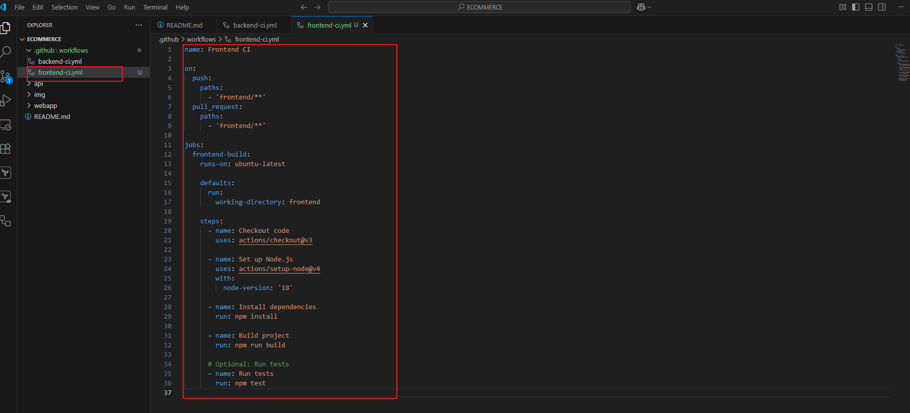

## Task 3: Backend AP set up:

 in the api directory a simple Node.js application with express that supports basic operations like listing products, adding a product to cart, and checking out. It also includes unit tests using Jest and Supertest.
 the backend consist of app.js,cart.test.js,cartController.js,cartRoutes.js,package.json and server.js
 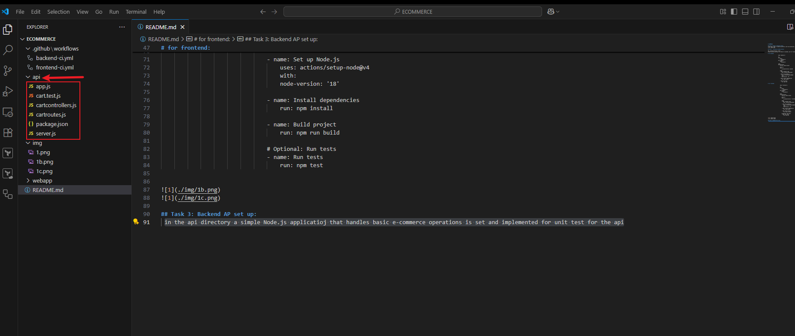
 after which i run the following commands on my terminal

            npm init -y
            npm install express
            npm install --save-dev jest supertest
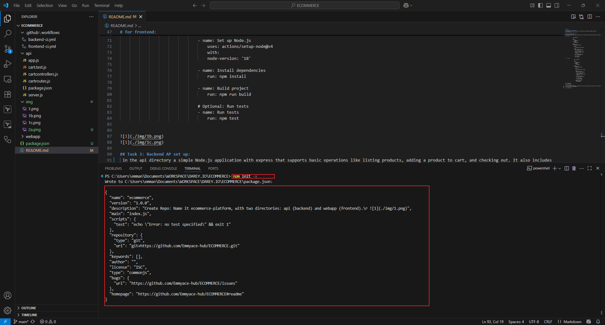
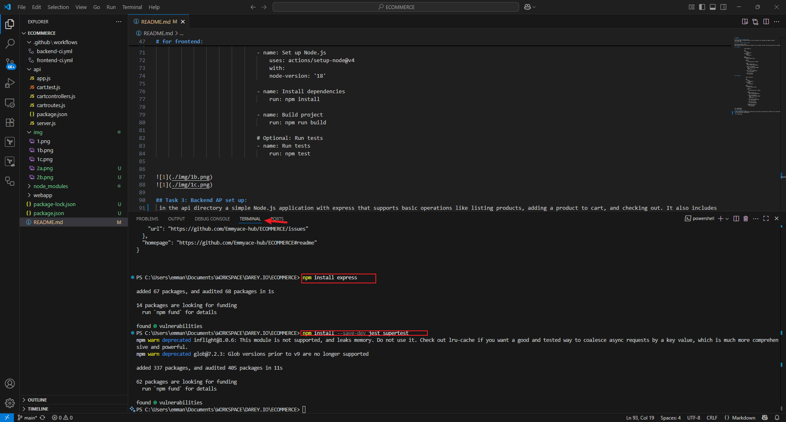

after all this have been ddone the next step is to start the server and run test using command:

            npm start
            npm test


# Task 4: Frontend web application set up:

Creating a simple frontend web application that interacts with the backend api ensuring it has the basic features like product listing, user login and order placement:
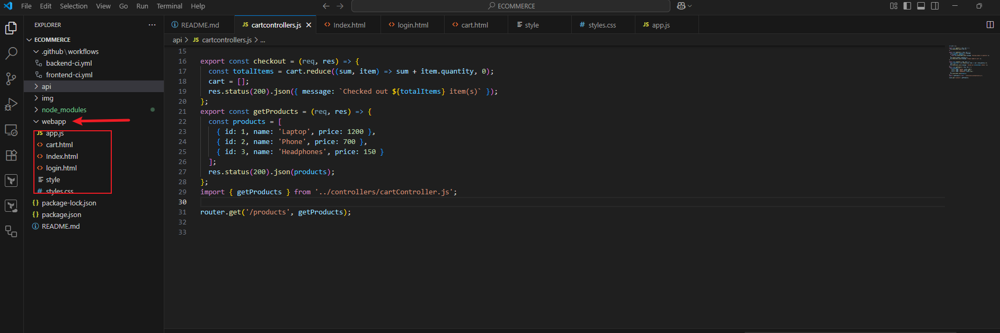

## product listing (index.html)

                <!DOCTYPE html>
                <html lang="en">
                <head>
                <meta charset="UTF-8">
                <title>Product Listing</title>
                <link rel="stylesheet" href="styles.css">
                </head>
                <body>
                <h1>Products</h1>
                <div id="products"></div>
                <a href="cart.html">View Cart</a>

                <script src="app.js"></script>
                </body>
                </html>

## login.html

                <!DOCTYPE html>
                <html lang="en">
                <head>
                <meta charset="UTF-8">
                <title>Login</title>
                </head>
                <body>
                <h1>Login</h1>
                <form id="loginForm">
                    <input type="text" placeholder="Username" required />
                    <input type="password" placeholder="Password" required />
                    <button type="submit">Login</button>
                </form>
                <script>
                    document.getElementById('loginForm').addEventListener('submit', (e) => {
                    e.preventDefault();
                    alert('Logged in (mock)');
                    window.location.href = 'index.html';
                    });
                </script>
                </body>
                </html>


## cart.html

                <!DOCTYPE html>
                <html lang="en">
                <head>
                <meta charset="UTF-8">
                <title>Your Cart</title>
                </head>
                <body>
                <h1>Cart</h1>
                <div id="cart"></div>
                <button id="checkoutBtn">Checkout</button>
                <a href="index.html">Back to Products</a>

                <script src="app.js"></script>
                </body>
                </html>


## app.js (handles all js logic)

                    const API_URL = 'http://localhost:3000/api';

                    document.addEventListener('DOMContentLoaded', () => {
                    if (document.getElementById('products')) {
                        fetch(`${API_URL}/cart/products`)
                        .then(res => res.json())
                        .then(products => {
                            const container = document.getElementById('products');
                            products.forEach(p => {
                            const div = document.createElement('div');
                            div.className = 'product';
                            div.innerHTML = `
                                <h3>${p.name}</h3>
                                <p>Price: $${p.price}</p>
                                <button onclick="addToCart('${p.name}', 1)">Add to Cart</button>
                            `;
                            container.appendChild(div);
                            });
                        });
                    }

                    if (document.getElementById('cart')) {
                        fetch(`${API_URL}/cart`)
                        .then(res => res.json())
                        .then(data => {
                            const cart = data.cart;
                            const container = document.getElementById('cart');
                            if (cart.length === 0) {
                            container.innerText = 'Cart is empty';
                            } else {
                            cart.forEach(item => {
                                const div = document.createElement('div');
                                div.innerText = `${item.product} (x${item.quantity})`;
                                container.appendChild(div);
                            });
                            }
                        });

                        document.getElementById('checkoutBtn').addEventListener('click', () => {
                        fetch(`${API_URL}/cart/checkout`, { method: 'POST' })
                            .then(res => res.json())
                            .then(data => {
                            alert(data.message);
                            location.reload();
                            });
                        });
                    }
                    });

                    function addToCart(product, quantity) {
                    fetch(`${API_URL}/cart/add`, {
                        method: 'POST',
                        headers: {
                        'Content-Type': 'application/json'
                        },
                        body: JSON.stringify({ product, quantity })
                    })
                    .then(res => res.json())
                    .then(data => {
                        alert(data.message);
                    });
                    }
after applying this command we can see the application was successful
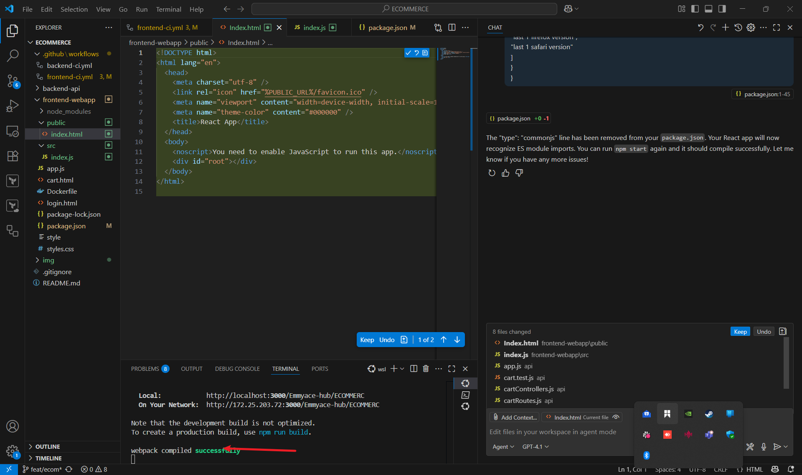

# Task 5: Docker integration
Creating a dockerfile for both the backend and frontend and modify the Github Actions workflows to build Docke images
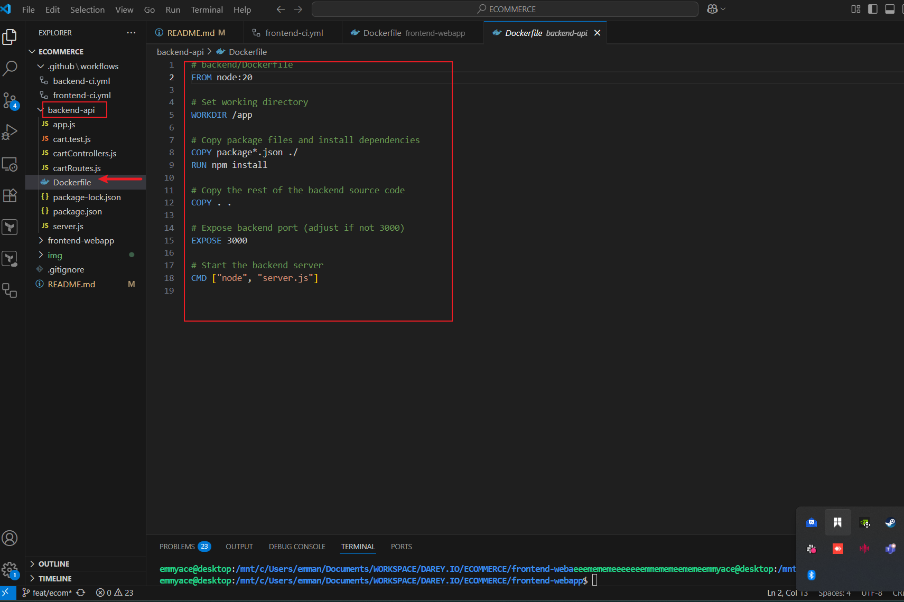
## for the backend:

                    # backend/Dockerfile
                    FROM node:18

                    # Set working directory
                    WORKDIR /app

                    # Copy package files and install dependencies
                    COPY package*.json ./
                    RUN npm install

                    # Copy the rest of the backend source code
                    COPY . .

                    # Expose backend port (adjust if not 3000)
                    EXPOSE 3000

                    # Start the backend server
                    CMD ["node", "server.js"]

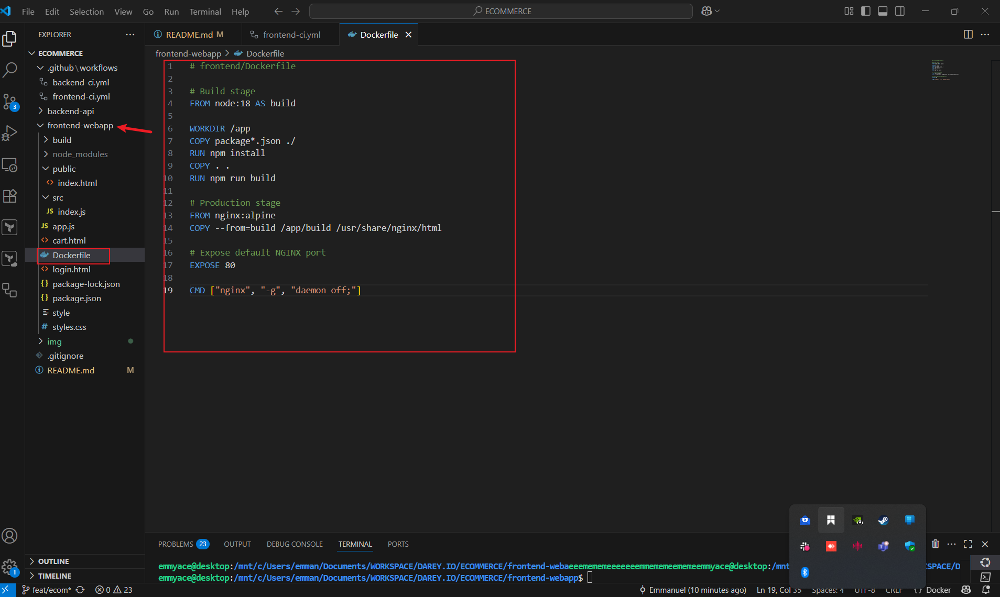                 
## for the frontend:

                    # frontend/Dockerfile

                    # Build stage
                    FROM node:18 AS build

                    WORKDIR /app
                    COPY package*.json ./
                    RUN npm install
                    COPY . .
                    RUN npm run build

                    # Production stage
                    FROM nginx:alpine
                    COPY --from=build /app/dist /usr/share/nginx/html

                    # Expose default NGINX port
                    EXPOSE 80

                    CMD ["nginx", "-g", "daemon off;"]


## modify  the workflow to build docker image:

# for backend:

                    name: Backend CI with Docker

                    on:
                    push:
                        paths:
                        - 'backend/**'
                    pull_request:
                        paths:
                        - 'backend/**'

                    jobs:
                    build-backend:
                        runs-on: ubuntu-latest

                        steps:
                        - name: Checkout Code
                            uses: actions/checkout@v3

                        - name: Set up Docker Buildx
                            uses: docker/setup-buildx-action@v3

                        - name: Build Docker Image
                            run: docker build -t ecommerce-backend ./backend


# for frontend:

                name: Frontend CI with Docker

                on:
                push:
                    paths:
                    - 'frontend/**'
                pull_request:
                    paths:
                    - 'frontend/**'

                jobs:
                build-frontend:
                    runs-on: ubuntu-latest

                    steps:
                    - name: Checkout Code
                        uses: actions/checkout@v3

                    - name: Set up Docker Buildx
                        uses: docker/setup-buildx-action@v3

                    - name: Build Docker Image
                        run: docker build -t ecommerce-frontend ./frontend


## Task 6: Deploy to AWS (cloud) using Github actions

Configure github actions to deploy docker images to AWS using github secrets to securely store and access cloud credentials

# step1: was securing the cloud credentials and attaching it to my repository:
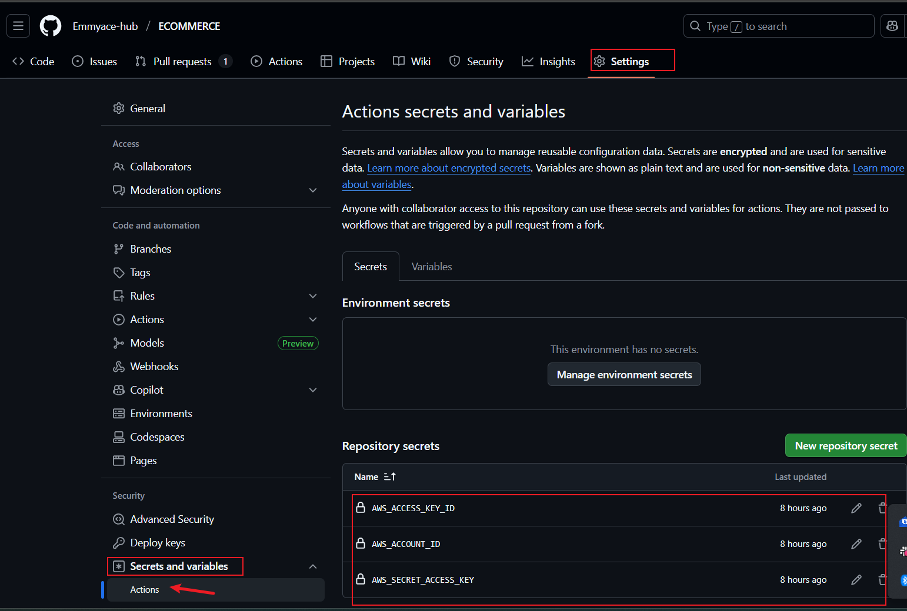

# step2: configure the docker image to deploy to cloud(aws)

* for backend
using the commands below to build the docker images

            docker build -t ecommmercebackend .
            docker ps
            docker image


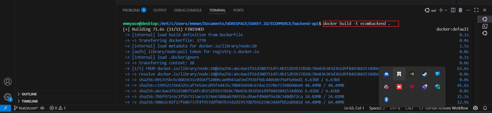
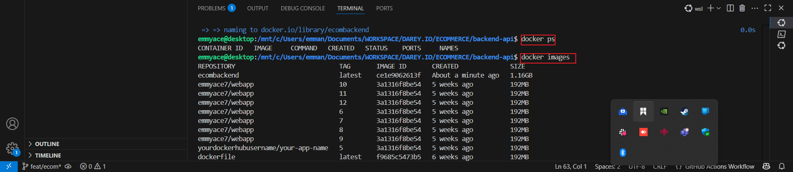
after the docker image was successfuly build it the CD was configured to continiously deploy to the AWS successfully through github actions:
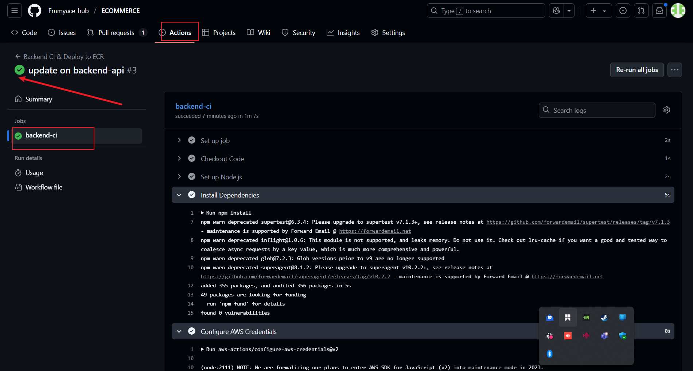
we can verify below on the AWS to show the image was succesfully deployed:
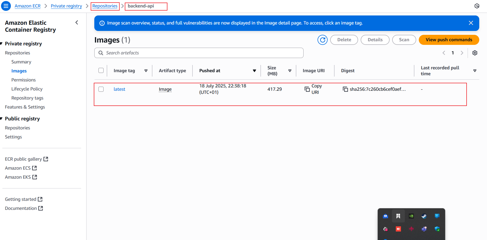

* for front end
after the docker image was successfuly build it the CD was configured to continiously deploy to the AWS successfully through github actions:

we can verify below on the AWS to show the image was succesfully deployed:
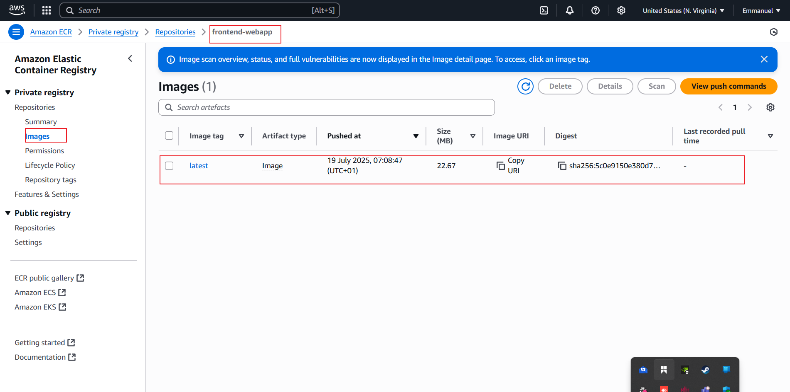


## 7 Performance & Security

### Add caching to speed up builds

**GitHub Actions Example:**
For Node.js projects, add a cache step before installing dependencies:


            ```yaml
                - name: Cache node modules
                    uses: actions/cache@v4
                    with:
                    path: ~/.npm
                    key: ${{ runner.os }}-node-${{ hashFiles('**/package-lock.json') }}
                    restore-keys: |
                        ${{ runner.os }}-node-
```
For Docker builds, use BuildKit inline cache:


            ```yaml
                - name: Build Docker Image with cache
                    run: |
                    docker build --build-arg BUILDKIT_INLINE_CACHE=1 --cache-from=type=registry,ref=myrepo/myimage:latest -t myrepo/myimage:latest .
            ```

### Secure secrets and sensitive data

- **Use GitHub Secrets:** Store AWS keys, API tokens, and other sensitive data in GitHub repository secrets. Reference them in workflows as `${{ secrets.MY_SECRET }}`.
- **Never commit secrets to your repository.**
- **Use environment variables** for secrets in Docker and Node.js apps, not hardcoded values.
- **Rotate secrets regularly** and remove unused ones.

**Example (GitHub Actions):**

            ```yaml
                - name: Configure AWS Credentials
                    uses: aws-actions/configure-aws-credentials@v2
                    with:
                    aws-access-key-id: ${{ secrets.AWS_ACCESS_KEY_ID }}
                    aws-secret-access-key: ${{ secrets.AWS_SECRET_ACCESS_KEY }}
                    aws-region: ${{ env.AWS_REGION }}
            ```