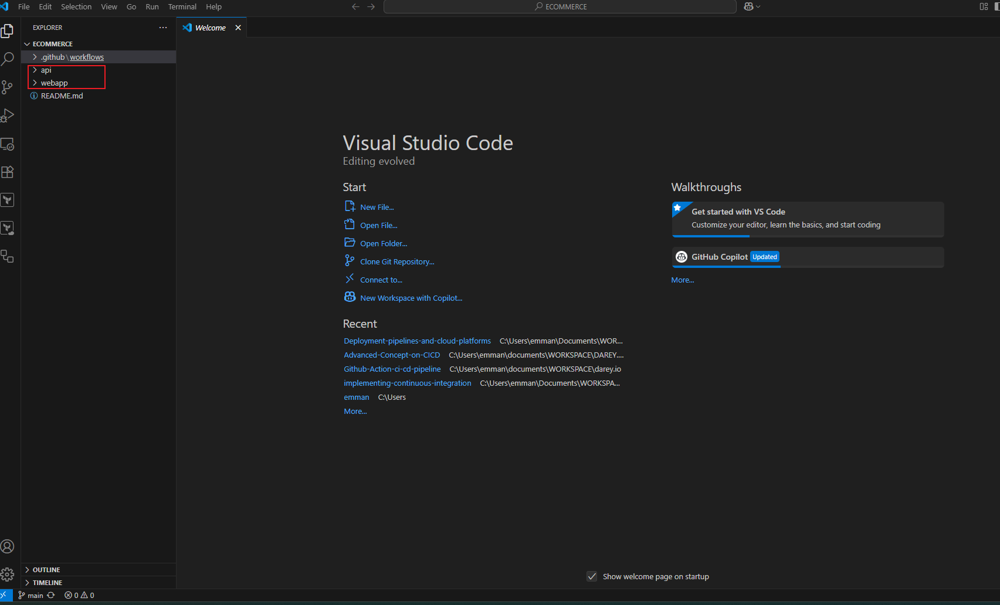

# ECOMMERCE

## Task 1: Project & Workflow Setup:
Create Repo: Name it ecommerce-platform, with two directories: api (backend) and webapp (frontend).

## Task 2:  Initialize GitHub Actions:

Add .github/workflows/ folder.
Create initial workflows for CI—one for backend, one for frontend. where we the code snipet where use to automate integration on both end

# for backend:

                        name: Backend CI

                        on:
                        push:
                            paths:
                            - 'backend/**'
                        pull_request:
                            paths:
                            - 'backend/**'

                        jobs:
                        backend-build:
                            runs-on: ubuntu-latest

                            defaults:
                            run:
                                working-directory: backend

                            steps:
                            - name: Checkout code
                                uses: actions/checkout@v3

                            - name: Set up Node.js
                                uses: actions/setup-node@v4
                                with:
                                node-version: '18'

                            - name: Install dependencies
                                run: npm install

                            - name: Run tests
                                run: npm test

# for frontend:

                            name: Frontend CI

                            on:
                            push:
                                paths:
                                - 'frontend/**'
                            pull_request:
                                paths:
                                - 'frontend/**'

                            jobs:
                            frontend-build:
                                runs-on: ubuntu-latest

                                defaults:
                                run:
                                    working-directory: frontend

                                steps:
                                - name: Checkout code
                                    uses: actions/checkout@v3

                                - name: Set up Node.js
                                    uses: actions/setup-node@v4
                                    with:
                                    node-version: '18'

                                - name: Install dependencies
                                    run: npm install

                                - name: Build project
                                    run: npm run build

                                # Optional: Run tests
                                - name: Run tests
                                    run: npm test

## Task 3: Backend AP set up:
 in the api directory a simple Node.js application with express that supports basic operations like listing products, adding a product to cart, and checking out. It also includes unit tests using Jest and Supertest.
 
 after which i run the following commands on my terminal

            npm init -y
            npm install express
            npm install --save-dev jest supertest

after all this have been ddone the next step is to start the server and run test using command:

            npm start
            npm test
